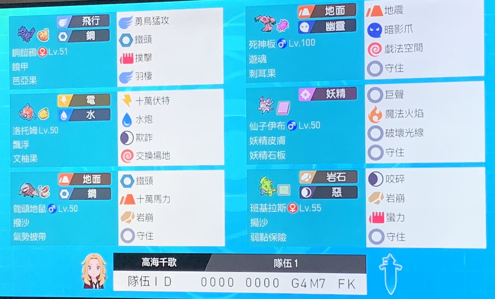
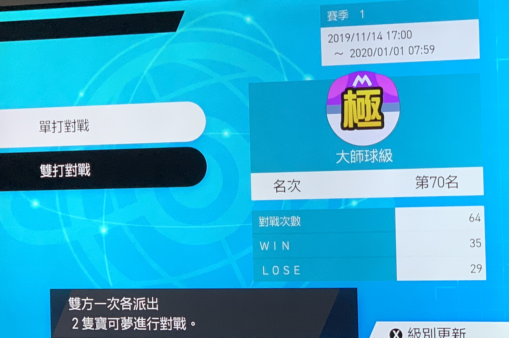
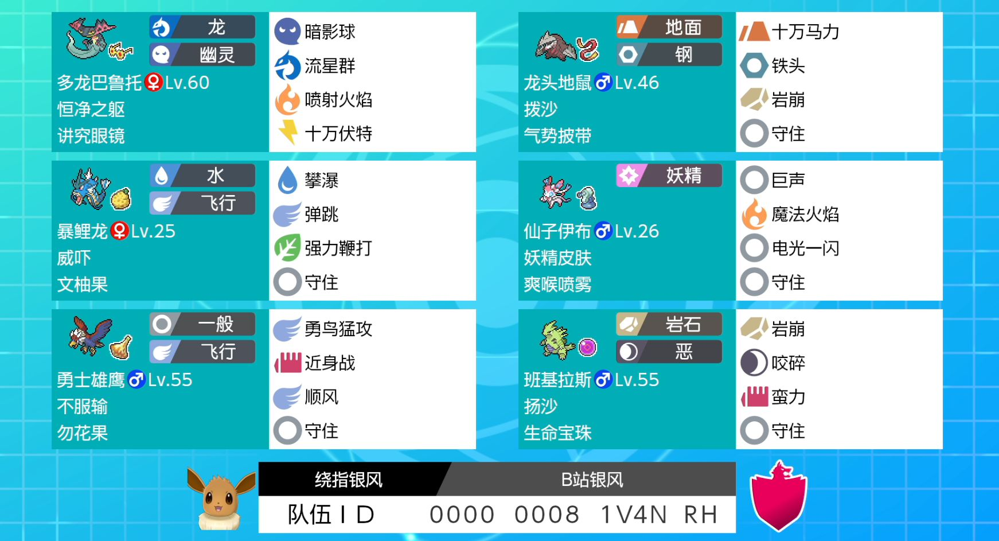
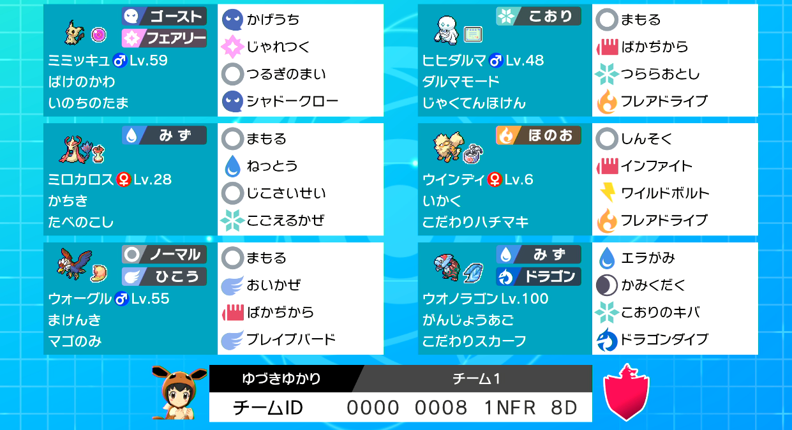
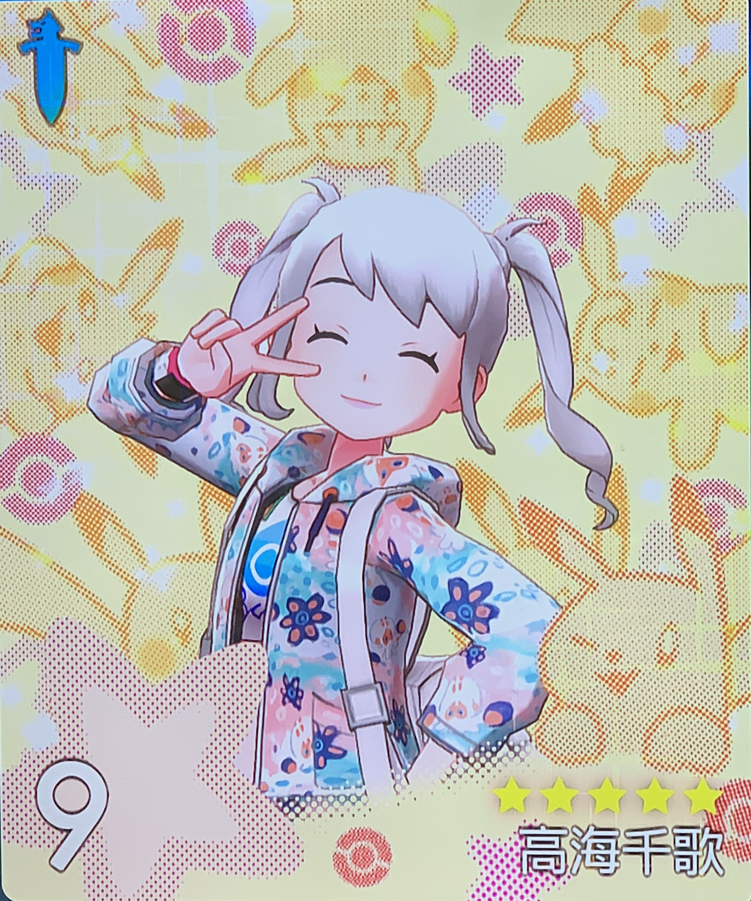

> 肝到爆，终于到了大师球

钢铠鸦 | 固执 | HA
:---: | :---: | :---: 
死神板 | 勇敢 | HA
洛托姆-冲洗 | 内敛 | HC
仙子伊布 | 内敛 | HC
龙头地鼠 | 爽朗 | AS
班吉拉斯 | 勇敢 | HA

这是一个围绕着死神板而搭建的队伍，死神板的双本地鬼在双打里贯穿性强，而且死神板耐久不俗（其实原因主要是我喜欢这个宝可梦），因此采用为队伍核心。

常规的选出是洛托姆死神板，位置交换开空间。然后极巨化死神板开始推队。后排放仙子伊布，班吉拉斯和钢铠鸦三选二。

假如棺材被威吓过了，极巨化选手可以是班吉拉斯，班吉拉斯极巨化后耐久非常好，假如对面没有帮忙触发弱点政策，还可以死神板地震触发。

当然，极巨化时机如果把握得好，那么这局可以说就稳了。一般的极巨化时机是场面占优势的时候，因为极巨化只有3回合，需要尽量打更多的输出。

对付现在排位上很多的银风的沙暴队，或者是曾经冲到过双打第一的狒狒队都可以洛托姆死神板首发，只要开出了第一轮空间，那么优势就会很明显。

##### 附上自己用的名片

